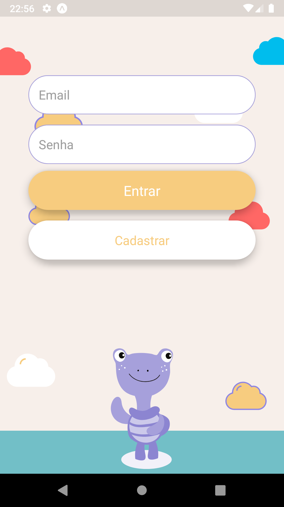
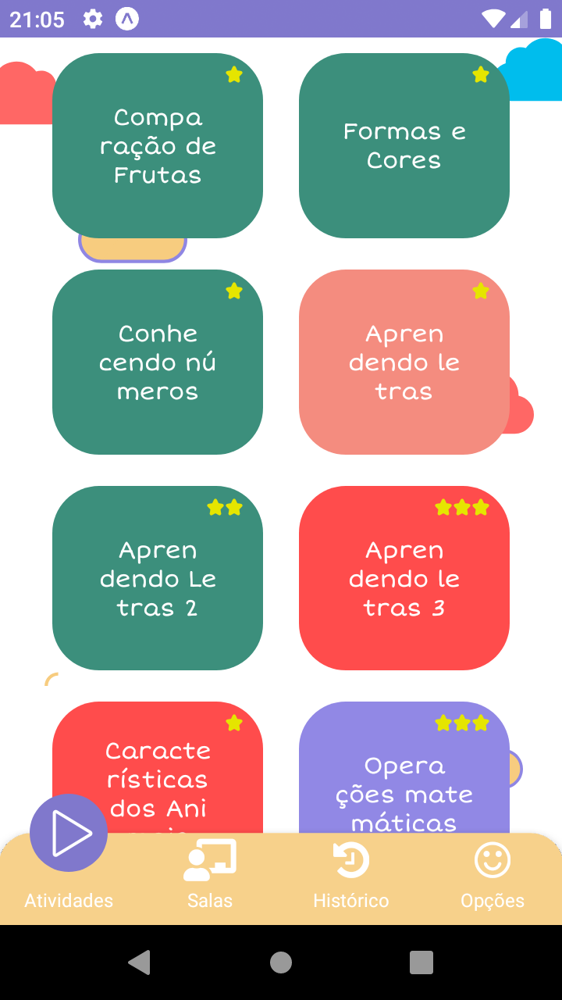
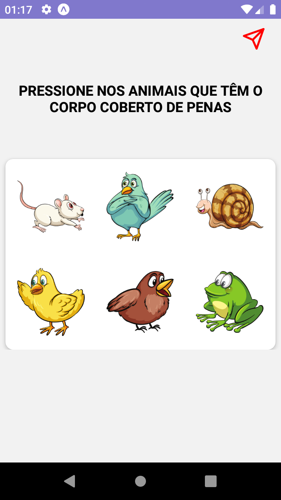

# Aprendendo com a Tatá

This project was made for my Final Paper during 2021

<h2>Core</h2>

This app implements the core concepts of the BNCC (Base Nacional Comum Curricular) for child education. The BNCC is a regulatory paper upon the brazilian education in general.

<h2>Prints</h2>

  
  
  
  

<h2>Core Libs</h2>
 
 <ul>
   <li>React Native</li>
   <li>Expo (Managed Workflow)</li>
   <li>Typescript</li>
   <li>Axios (HTTP Client)</li>
   <li>react-native-drax</li>
   <li>date-fns</li>
   <li>react-hook-form</li>
   <li>Reanimated V2</li>
   <li>Styled Components</li>
   <li>@gorhom/bottom-sheet</li>
 </ul>

<h2>Social</h2>

